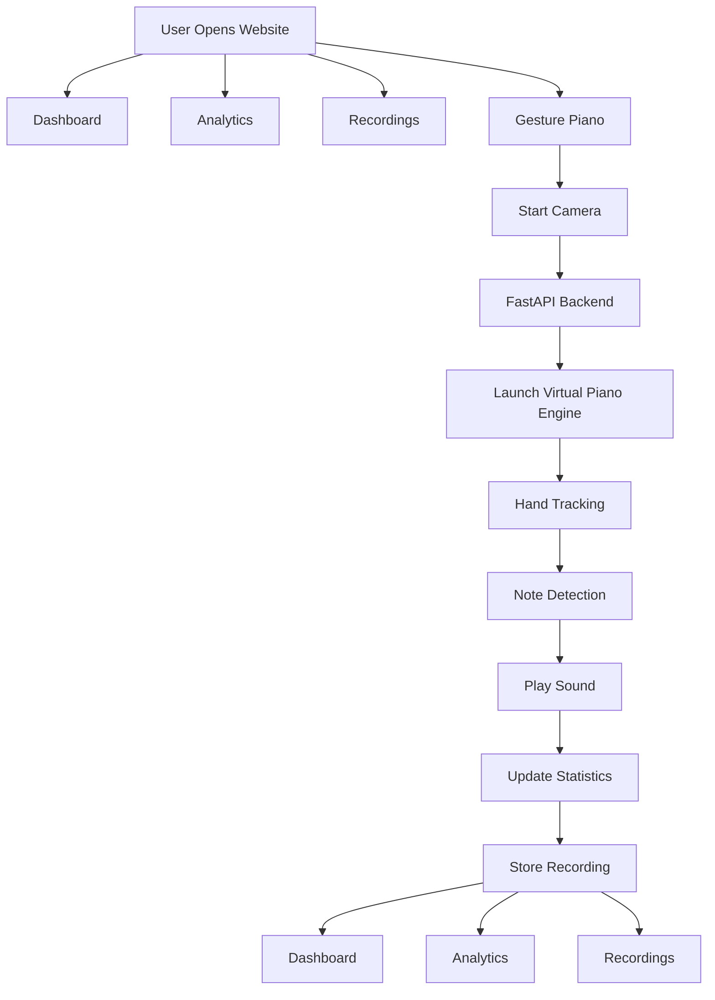
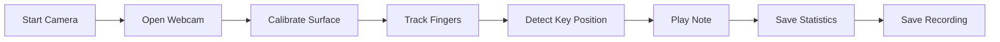

# 🎹 Kaatru-Mozhi Frontend

A modern React + Vite web interface for the Kaatru-Mozhi Virtual Piano project.

The frontend provides:

- Dashboard for live statistics
- Analytics page with piano heatmap
- Recordings management
- Virtual Piano control panel
- Backend status monitoring
- Recording playback controls
- Recording download support

---

# 🚀 Tech Stack

- React.js
- Vite
- React Router DOM
- CSS3
- FastAPI Backend Integration

---

# 📂 Folder Structure

```text
frontend/
│
├── public/
│
├── src/
│   ├── components/
│   │   ├── Navbar.jsx
│   │   ├── StatCard.jsx
│   │   └── RecordingCard.jsx
│   │
│   ├── pages/
│   │   ├── Home.jsx
│   │   ├── Dashboard.jsx
│   │   ├── Analytics.jsx
│   │   ├── Recordings.jsx
│   │   ├── PianoPage.jsx
│   │   └── About.jsx
│   │
│   ├── styles/
│   │   └── global.css
│   │
│   ├── App.jsx
│   └── main.jsx
│
├── package.json
├── vite.config.js
└── README.md
```

---

# ⚙️ Installation

Clone the repository:

```bash
git clone https://github.com/n-j-m06/Kaatru-Mozhi.git
```

Move into frontend folder:

```bash
cd frontend
```

Install dependencies:

```bash
npm install
```

Start development server:

```bash
npm run dev
```

Frontend will run at:

```text
http://localhost:5173
```
# 📊 Application Flow



---

# 🎹 Gesture Piano Workflow



---

# 📈 Features

## Dashboard

- Total notes played
- Most played note
- Backend status
- Live statistics

## Analytics

- Piano heatmap
- Most played notes
- Usage visualization

## Recordings

- View all recordings
- Playback recordings
- Stop playback
- Download recordings

## Gesture Piano

- Start camera directly from UI
- Launch backend piano engine
- Recording controls
- Real-time note detection

---

# 🎯 Future Improvements

- Live webcam stream inside browser
- Real-time note visualization
- Session history
- User authentication
- Cloud recording storage
- Advanced analytics dashboard
- Multi-user support

---

# 👨‍💻 Developed By

**Kaatru-Mozhi Team**

Virtual Gesture-Based Piano System using Computer Vision and Hand Tracking.
